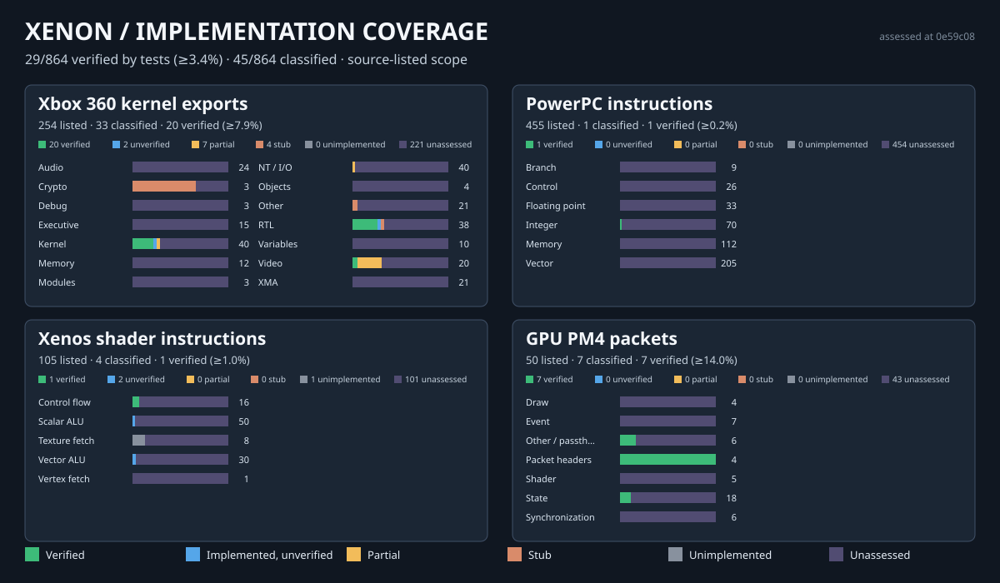

# Xenon Recomp

[](https://github.com/nimauria/Xenon-Recomp/actions/workflows/windows.yml?query=branch%3Adevelopment-restructure) [](https://github.com/nimauria/Xenon-Recomp/actions/workflows/linux.yml?query=branch%3Adevelopment-restructure) [](https://github.com/nimauria/Xenon-Recomp/actions/workflows/ci.yml?query=branch%3Adevelopment-restructure)

**An experimental Xbox 360 ahead-of-time recompilation framework and shared native runtime.**

Xenon takes the PowerPC code from an Xbox 360 executable, analyses it, and translates it ahead of time into C++ that a normal host compiler builds into a native module. That module then runs on a shared Xenon runtime, which implements the Xbox 360 hardware and system behaviour the game expects.

What sets the project apart:

- **Ahead-of-time recompilation.** Guest PowerPC code is analysed and compiled to native code before the game starts, not interpreted or translated instruction by instruction while it runs.
- **One runtime, many games.** Recompiled titles are meant to share one implementation of the Xbox 360 environment (CPU, memory, kernel, filesystem, audio, input and graphics) instead of each port carrying its own.
- **Reusable hardware subsystems.** Xbox-specific behaviour lives in generic Xenon subsystems. Game-specific knowledge lives in separate game modules.
- **Native graphics through a shared Xenos layer.** A common frontend interprets the Xbox 360 GPU, and the Vulkan and Direct3D 12 backends render from the same backend-neutral representation.
- **Reusable analysis knowledge.** Confidence-scored function fingerprints are designed to let analysis evidence carry over between executable revisions instead of being rediscovered.
- **A framework and launcher, not a single-game port.** Xenon includes tooling that prepares a game automatically and a launcher intended to host several titles.

The long-term goal is an adaptive, cross-platform Xbox 360 recompilation platform. You would import your lawfully obtained games into Xenon Launcher, Xenon would prepare native game modules automatically, and you would play supported titles from one library. The shared runtime's compatibility would improve as more titles are investigated. That platform does not exist yet; see [Long-term vision](#long-term-vision) for what is planned and how it builds on the existing foundation.

> [!WARNING]
> **Early development: no confirmed playable titles**
>
> Xenon is under active development. Much of the core infrastructure is implemented and covered by automated tests, but running commercial games is still experimental. **No commercial Xbox 360 game is currently confirmed playable**, and there is no public release or release date. You cannot yet download Xenon and play your Xbox 360 library with it.
>
> The current work is getting the first title, Ace Combat 6, past an early runtime stall. See [Current milestone](#current-milestone-project-gracemeria).

> [!NOTE]
> Xenon does not distribute Xbox 360 games, executables, firmware, title updates, DLC, encryption keys or any other proprietary content. You must supply content from lawful sources.

## Contents

- [Current milestone: Project Gracemeria](#current-milestone-project-gracemeria)
- [How Xenon differs from an emulator](#how-xenon-differs-from-an-emulator)
- [Component status](#component-status)
- [Architecture](#architecture)
- [Recompilation pipeline](#recompilation-pipeline)
- [Graphics and audio](#graphics-and-audio)
- [Platform support](#platform-support)
- [Building from source](#building-from-source)
- [Testing and CI](#testing-and-ci)
- [Long-term vision](#long-term-vision)
- [Roadmap](#roadmap)
- [Contributing](#contributing)
- [Documentation](#documentation)
- [Acknowledgements](#acknowledgements)
- [Legal](#legal)

---

## Current milestone: Project Gracemeria

**Project Gracemeria** is the integration effort for *Ace Combat 6: Fires of Liberation*. It is the first real title used to exercise the whole stack.

Where it stands on the `development-restructure` branch:

- The game is prepared, and its recompiled guest code runs on the shared runtime without crashing immediately. Guest threads, the GPU command pump and audio callbacks all start.
- **GPU and audio processing then stall.** They complete an initial pass, or a small number of passes, and then stop making useful progress.
- **No graphical output, no audio playback and no gameplay have been demonstrated.** The title has not been shown to reach a menu.
- **The cause is not yet established.** The investigation note lists structural candidates in the guest-callback, event-signalling and GPU/CPU handshake paths. Each one is still a hypothesis to test, not a confirmed root cause.

The current priority is to resolve the runtime synchronisation and callback progression that the stall exposes. Any fix belongs in generic runtime code with its own tests, not in an Ace Combat 6 special case. Details, probes and the suggested debugging order are in [`docs/runtime/AC6_RUNTIME_INVESTIGATION.md`](docs/runtime/AC6_RUNTIME_INVESTIGATION.md).

*Gears of War 2* is planned as a later target, chosen because it never received an official PC port. No work on it has started.

---

## How Xenon differs from an emulator

A conventional Xbox 360 emulator, such as Xenia, translates guest code while the game runs. It also emulates the console's hardware and operating-system services. That approach handles almost any title without per-game preparation, and it is the reference for much of what Xenon knows about the platform.

Xenon moves the CPU translation step to before the game runs:

- **Ahead-of-time recompilation.** Xbox 360 PowerPC (including VMX128) code is analysed and translated into C++, then built with a host compiler into a native game module.
- **Shared runtime.** Every recompiled title uses common CPU-execution, memory, kernel, XAM, filesystem, audio, input and graphics infrastructure.
- **Modular game integration.** Analysis hints, generated code and any unavoidable compatibility adjustments stay in the individual game project wherever possible. The architectural rule is: *game projects may depend on Xenon; Xenon must never depend on one specific game project.*
- **Native graphics.** A shared Xenos frontend turns Xbox 360 GPU commands, shaders and EDRAM behaviour into common representations that native Vulkan and Direct3D 12 backends consume.
- **Portability goals.** Windows and Linux on x86-64 are the current development platforms. Other architectures and operating systems are goals, not supported targets.

Recompilation does not remove the need to model the console. The runtime still implements Xbox 360 hardware behaviour in software: the GPU command processor, the 10 MiB EDRAM, XMA audio decoding, and kernel objects and scheduling. A bounded dynamic fallback executor also exists for executable guest code that static analysis did not discover ([Gen 7](docs/cpu/DYNAMIC_FALLBACK_GEN7.md)). Recompilation replaces the CPU interpreter or JIT on the normal path. It does not replace the rest of the console model.

### Game modules

A game module owns title-specific knowledge and consumes Xenon's shared APIs. That knowledge can include:

- supported title and version identifiers;
- symbols and function boundaries;
- generated recompilation output;
- hooks and compatibility patches;
- title-update and DLC definitions;
- launcher metadata and module settings;
- unavoidable title-specific renderer or service adaptations.

Modules must not duplicate Xbox 360 CPU semantics, guest memory, XEX parsing, Xenos command processing or generic xboxkrnl/XAM behaviour. See [`docs/modules/CONTENT_IDENTITY.md`](docs/modules/CONTENT_IDENTITY.md) and [`docs/modules/CONTENT_SERVICES.md`](docs/modules/CONTENT_SERVICES.md).

---

## Component status

Status labels:

- **Tested infrastructure:** implemented, with automated tests that run in CI.
- **Implemented foundation:** the core functionality exists, but testing is partial or the feature is not yet connected end to end.
- **Integration ongoing:** being connected to real-title execution, where open problems remain.
- **Under active development:** substantial work is still in progress.
- **Experimental:** works in limited, developer-controlled conditions.
- **Planned:** does not exist yet.

| Component | Status | Notes |
| --- | --- | --- |
| CPU and PowerPC recompilation | Tested infrastructure | PPC, VMX and VMX128 decoding and lifting, Xenon IR, optimiser, C++ AOT emission and compiled-function lookup. Gen 8 checks generated code against independently transcribed semantics. Correctness across a whole retail title is not yet established. |
| Memory V2 | Tested infrastructure | 512 MiB unified physical RAM, Xbox address-space aliases, page protection, MMIO, load-reserve/store-conditional, host VM integration and CPU/GPU coherency notifications. |
| XEX loading | Implemented foundation | XEX1/XEX2 headers, AES decryption, Basic/LZX/delta decompression, imports/exports/TLS/relocations and title updates. Exercised with Ace Combat 6. Wider retail qualification remains. |
| Recompilation analysis and generation | Implemented foundation | Function discovery, control-flow and value analysis, module hints, sharded C++ generation and a content-addressed cache (Gen 5–11). Exercised on Ace Combat 6. Not shown to be reliable across retail titles generally. |
| Kernel and guest threading | Integration ongoing | Handles, objects, threads, events, semaphores, mutants, timers, waits, file I/O and module management. Thread, event and wait behaviour under a real title is part of the open AC6 investigation. |
| Runtime session | Integration ongoing | `XenonSession` ties the subsystems together for one title. `xenon_runtime_host` runs it in a separate process with SDL2 presentation. |
| Xenos graphics frontend | Tested infrastructure | PM4 processing, shader decoding and translation, textures, the EDRAM model, resolves and capture/replay are covered by subsystem tests. No end-to-end AC6 rendering yet. |
| Vulkan backend | Tested infrastructure | Vulkan 1.3. Tests run on Linux CI against Mesa llvmpipe. Not yet shown rendering a commercial title. |
| Direct3D 12 backend | Tested infrastructure | Feature level 12_0. Tests run on Windows CI against the Microsoft Basic Render Driver. As of 9 October 2026, the backend capability test was the one open Windows CI failure. |
| Audio and XMA | Implemented foundation | SDL2 output, XMA decoding through FFmpeg `XMAFRAMES`, a voice mixer and Xbox render-driver callbacks, all with regression tests. Real-title playback is blocked by the AC6 stall. |
| Input | Implemented foundation | SDL2/SDL3 controllers, XInput on Windows, keyboard and mouse, profiles, HOTAS mapping and XAM guest marshalling. |
| Filesystem and content management | Implemented foundation | VFS, host paths, GDFX disc images, STFS packages, Xbox path semantics, and title-update, DLC and save content services. |
| XAM services | Implemented foundation | Offline users and profiles, locale, content, notifications and achievements. Explicit "unsupported" results instead of fabricated success. |
| Networking | Experimental | Xenon Network client foundation, offline by default. There is no hosted service and no XAM/XNet mapping. This is not Xbox Live. |
| Qt launcher | Under active development | Qt 6 Quick/QML library, modules, profiles, settings, diagnostics and runtime-host supervision. Built in Linux CI. |
| Game preparation | Experimental | `xenon-prepare` discovers, recompiles, builds and caches every XEX in a title. It requires a local C++ toolchain. Tested end to end with synthetic content in CI. |
| Platform support | Under active development | Windows and Linux x86-64 only. See [Platform support](#platform-support). |

**Component status is not game compatibility.** A subsystem that passes its own tests can still be incomplete or wrong for a specific title. Real-title validation is what exposes incorrect Xbox assumptions, and so far it has been performed only on Ace Combat 6, which has not progressed past the stall described above.

---

## Architecture

Xenon works in two stages. **Preparation** happens once per game version, before play. **Execution** happens in a separate runtime process that the launcher supervises.

```text
PREPARATION (ahead of time)

  User-supplied game content
  (disc image, folder or XEX)
            │
            ▼
  XEX loader: parse, decrypt,
  decompress, apply title update
            │
            ▼
  Recompilation (xenon-prepare)
  analyse → decode → IR →
  optimise → C++ → host compiler
            │
            ▼
  Native game module
  (cached, content-addressed)


EXECUTION (xenon_runtime_host)

  Native game module + mapped XEX
            │
            ▼
  XenonSession: shared runtime
  ├─ CPU execution (AOT + fallback)
  ├─ Memory V2 (one guest RAM)
  ├─ Kernel / XAM exports
  ├─ Filesystem and content
  ├─ Audio (XMA, render driver)
  └─ Input
            │
            │ PM4 commands written
            │ to guest memory
            ▼
  Xenos frontend
  (PM4, shaders, EDRAM, textures)
            │
            ▼
  Backend-neutral graphics IR
  + shared backend core
            │
      ┌─────┴─────┐
      ▼           ▼
   Vulkan    Direct3D 12
      └─────┬─────┘
            ▼
  Host system (SDL2 window,
  audio device, controllers)
```

Important boundaries:

- The CPU, GPU, kernel, XEX loader and devices share **one guest memory** (Memory V2). No subsystem keeps a private copy of guest RAM.
- The launcher never executes guest code. It starts `xenon_runtime_host` for each session and talks to it through a file-based launch, status and stop contract ([`RUNTIME_HOST.md`](docs/runtime/RUNTIME_HOST.md)). Qt is a launcher-only dependency.
- Vulkan and D3D12 contain no Xbox command processor. They consume the frontend's normalised state.

Source ownership, CMake targets and dependency rules are documented in [`docs/architecture/PROJECT_STRUCTURE.md`](docs/architecture/PROJECT_STRUCTURE.md).

---

## Recompilation pipeline

```text
XEX parsing → function discovery → control-flow analysis
  → PPC decoding → Xenon IR → optimisation
  → C++ AOT generation → native compilation
  → module registration → runtime execution
```

1. **XEX parsing.** The XEX loader produces the effective PE image and its section, import, export, TLS and relocation metadata ([`XEX_LOADER_V2.md`](docs/xbox/XEX_LOADER_V2.md)).
2. **Function discovery and control flow.** Discovery starts from the entry point, exports, direct calls and branches. It then adds value tracking and resolution of indirect calls and branches, jump-table recovery, and `NoReturn` inference. Indirect flow it cannot resolve is reported rather than guessed.
3. **Decoding and IR.** Each discovered function is decoded and lifted into the architecture-neutral Xenon IR, verified, and optimised.
4. **C++ generation.** The C++ AOT backend emits deterministic, sharded source along with a compiled-function registry, import tables and a CMake project.
5. **Native compilation and registration.** A host C++ compiler builds the generated project into a native module. The runtime binds that module's registry into the CPU execution context.
6. **Execution.** Guest calls dispatch to compiled native functions. If a target is missing, the bounded dynamic fallback runs it and records the observation, so a later preparation can include that code.

**Module hints** let a game project supply function boundaries, known symbols, data regions, hooks and patches. They never provide PowerPC semantics.

**Automatic game preparation.** `xenon-prepare`, which the launcher drives, accepts a disc image, an extracted folder or a loose XEX. It discovers every executable module, then analyses, generates, compiles and validates each one. The result goes into a **content-addressed cache** keyed by the effective (decrypted, title-update-patched) image, the module and its hints, Xenon's generated-code ABI, the build configuration and the compiler, so unchanged modules are not rebuilt. Preparation still needs a C++ toolchain on the local machine (MSVC or Build Tools on Windows; a C++20 compiler and CMake on Linux). Xenon does not bundle one yet.

The standalone tools (`recomp-driver`, `ppc-disasm`, `ir-dump`, `import-scanner` and `module-inspector`) share the same analysis and are useful for inspecting a title.

These tools have been run on a single retail title. They are not yet proven reliable across commercial games in general.

| Analysis generation | Document |
| --- | --- |
| Pipeline overview | [`RECOMPILATION_PIPELINE.md`](docs/recomp/RECOMPILATION_PIPELINE.md) |
| V2/V3: parallel analysis, discovery quality | [`RECOMP_ANALYSIS_V2.md`](docs/recomp/RECOMP_ANALYSIS_V2.md), [`RECOMP_ANALYSIS_V3.md`](docs/recomp/RECOMP_ANALYSIS_V3.md) |
| Gen 5: adaptive analysis hardening | [`RECOMP_ANALYSIS_GEN5.md`](docs/recomp/RECOMP_ANALYSIS_GEN5.md) |
| Gen 6: value and indirect-flow analysis | [`RECOMP_ANALYSIS_GEN6.md`](docs/recomp/RECOMP_ANALYSIS_GEN6.md) |
| Gen 7: dynamic fallback safety net | [`DYNAMIC_FALLBACK_GEN7.md`](docs/cpu/DYNAMIC_FALLBACK_GEN7.md) |
| Gen 8: semantic verification | [`SEMANTIC_VERIFICATION_GEN8.md`](docs/cpu/SEMANTIC_VERIFICATION_GEN8.md) |
| Gen 9: universal knowledge base | [`UNIVERSAL_KNOWLEDGE_GEN9.md`](docs/recomp/UNIVERSAL_KNOWLEDGE_GEN9.md) |
| Gen 10: content-addressed compilation graph | [`COMPILATION_GRAPH_GEN10.md`](docs/recomp/COMPILATION_GRAPH_GEN10.md) |
| Gen 11: autonomous game intake | [`GAME_INTAKE_GEN11.md`](docs/recomp/GAME_INTAKE_GEN11.md) |
| Preparation, library and cache | [`GAME_PREPARATION.md`](docs/development/GAME_PREPARATION.md) |

---

## Graphics and audio

### Xenos graphics

The shared Xenos frontend (`src/graphics/xenos/`) processes PM4 command rings and indirect buffers. It also handles registers and predication, normalises draws and primitives, and decodes, reflects and lowers Xenos shaders. Texture tiling and endian conversion happen in the frontend too. A 10 MiB EDRAM model tracks colour and depth ownership per tile, and resolves are performed back into guest memory.

Shaders are lowered to HLSL and compiled with DXC to DXIL (Direct3D 12) and SPIR-V (Vulkan). Command handling above the native API is written once, in `src/graphics/common/`. That covers EDRAM ownership transfers, resolves, draw setup, shader variants, pipelines, submission and presentation. Each backend supplies only its native calls. A small number of known Vulkan/D3D12 behavioural differences are listed in [`RESTRUCTURE_FINDINGS.md`](docs/development/RESTRUCTURE_FINDINGS.md).

Unsupported packets, formats and shader features are counted and reported rather than silently approximated.

**What has been demonstrated:** subsystem and backend tests, including cross-backend EDRAM and resolve checks on software devices in CI. **What has not:** sustained rendering, or any rendered frame, from Ace Combat 6. Replaying captured retail command streams is also still outstanding.

See [`GPU_V1.md`](docs/graphics/GPU_V1.md), [`NATIVE_BACKENDS.md`](docs/graphics/NATIVE_BACKENDS.md), [`EDRAM_RENDERING.md`](docs/graphics/EDRAM_RENDERING.md), [`HLSL_DXC.md`](docs/graphics/HLSL_DXC.md) and the validation log in [`VALIDATION.md`](docs/graphics/VALIDATION.md).

### Audio

Audio V1 implements the Xbox render-driver and XMA context semantics in Xenon. That includes XMA packet and frame decoding through a pinned, Xenia-maintained FFmpeg build that exposes `XMAFRAMES`, plus bounded voice mixing and resampling, and an SDL2 host output device. There is deliberately no silent null backend.

The guest's render-driver callbacks are driven by **queue credits**. A credit is returned only when the host mixer consumes a frame the guest submitted. If a title's callback runs but submits nothing, the callbacks stop after eight invocations. In Ace Combat 6, audio callbacks stop after their initial passes. Whether this credit behaviour is the cause is one of the open questions in the investigation.

Mixer, XMA and export regression tests pass. **Real-title audio output has not been achieved.** See [`AUDIO_V1.md`](docs/audio/AUDIO_V1.md).

---

## Platform support

| Platform | Architecture | Current state | End-user support |
| --- | --- | --- | --- |
| Windows | x86-64 | Development platform: MSVC, built and tested in CI | Not available (no release) |
| Linux | x86-64 | Development platform: GCC, built and tested in CI | Not available (no release) |
| Windows on ARM | ARM64 | Planned. Architecture detection only; no ARM64 code generation or CI | Not available |
| macOS / Apple Silicon | ARM64 | Planned. Platform detection and RPATH groundwork only; never built or validated | Not available |
| Android phones and tablets | ARM64 | Planned. An empty reserved source directory only; no runtime, launcher or graphics support | Not available |
| Metal (graphics backend) | n/a | Planned. No native Metal backend exists | n/a |

Development and validation target x86-64 only. The ARM64 code-generation directory is a placeholder ([`src/cpu/arm64/README.md`](src/cpu/arm64/README.md)), and ARM64 bring-up is deferred until a title runs end to end on x86-64. See [`HOST_PORTABILITY_V1.md`](docs/platforms/HOST_PORTABILITY_V1.md).

---

## Building from source

Xenon is currently a developer-oriented project. Building it produces the runtime, tools, tests and (optionally) the launcher. It does not produce a consumer application.

### Requirements

| Requirement | Notes |
| --- | --- |
| CMake 3.25+ and Ninja | The supplied presets use Ninja |
| C++20 compiler | MSVC (Visual Studio 2022 developer environment) on Windows; GCC on Linux. These are the configurations CI builds |
| Python 3 and Git | Dependency bootstrap and build-accountability tooling |
| SDL2 and XMA-capable FFmpeg | Required for audio, which is on by default. Resolved automatically in `AUTO` mode; see below |

Optional components:

| Component | Needed for |
| --- | --- |
| Vulkan SDK | Vulkan backend (the target is skipped if the SDK is not found) |
| Windows SDK | Direct3D 12 backend and XInput |
| DXC | Shader compilation to DXIL/SPIR-V |
| Qt 6.6+ | The launcher (skipped if Qt is not found) |
| SDL3 | Optional SDL3 input backend |
| Mesa `llvmpipe`, Vulkan validation layers | Running Vulkan tests on a machine without a GPU ([`TESTING.md`](docs/development/TESTING.md)) |

Native dependencies are resolved by one managed layer ([`DEPENDENCIES.md`](docs/development/DEPENDENCIES.md)). Development presets use `AUTO` mode: explicit or already-managed dependencies come first, compatible system packages may be used, and missing pinned dependencies can be provisioned. On Windows x64, `AUTO` builds may use the committed FFmpeg/XMA bundle under `third_party/xenon-ffmpeg`. Building the pinned FFmpeg from source needs MSYS2 `bash`/`make` on Windows, and `make` and NASM on Linux.

### Presets

```text
linux-x64-debug        development build with tests
linux-x64-sanitizers   reduced build under ASan/UBSan
linux-x64-release      managed dependencies + installer packaging
windows-x64-debug      development build with tests
windows-x64-release    managed dependencies + installer packaging
```

Linux:

```bash
cmake --preset linux-x64-debug
cmake --build build/linux-x64-debug
ctest --test-dir build/linux-x64-debug --output-on-failure
```

Windows (from a Visual Studio developer prompt):

```bash
cmake --preset windows-x64-debug
cmake --build build/windows-x64-debug
ctest --test-dir build/windows-x64-debug --output-on-failure
```

To include the launcher, pass the Qt installation prefix when configuring, for example `-DCMAKE_PREFIX_PATH=/path/to/Qt/6.x.x/gcc_64`. [`TESTING.md`](docs/development/TESTING.md) also covers the source-ownership audit (`tools/development/build_accountability.py`), headless Vulkan, and syntax-checking D3D12 code from Linux.

A full debug test run takes a while. Several tests build generated projects against the Xenon tree.

<details>
<summary>Launcher-only Windows build</summary>

```powershell
cmake -S . -B build\launcher-ui -G Ninja `
  -DCMAKE_BUILD_TYPE=Debug `
  -DCMAKE_PREFIX_PATH="C:\Qt\6.x.x\msvc2022_64" `
  -DXENON_BUILD_LAUNCHER=ON

cmake --build build\launcher-ui --target xenon_launcher
```

Windows CI currently builds with `-DXENON_BUILD_LAUNCHER=OFF`, so the launcher's CI coverage comes from Linux.

</details>

<details>
<summary>Major CMake options</summary>

The authoritative list is in [`CMakeLists.txt`](CMakeLists.txt) and [`cmake/Dependencies.cmake`](cmake/Dependencies.cmake).

```text
XENON_BUILD_TESTS                    XENON_ENABLE_AUDIO
XENON_BUILD_BENCHMARKS               XENON_ENABLE_INPUT
XENON_BUILD_LAUNCHER                 XENON_INPUT_ENABLE_SDL2
XENON_BUILD_RUNTIME_HOST             XENON_INPUT_ENABLE_SDL3
XENON_BUILD_INSTALLER                XENON_INPUT_ENABLE_XINPUT
XENON_ENABLE_MEMORY                  XENON_ENABLE_NETWORK
XENON_MEMORY_DEFAULT_DIRECT_APERTURE XENON_ENABLE_FILESYSTEM
XENON_ENABLE_GRAPHICS                XENON_ENABLE_KERNEL
XENON_ENABLE_VULKAN                  XENON_DEPENDENCY_MODE
XENON_ENABLE_D3D12                   XENON_AUTO_BOOTSTRAP_DEPS
XENON_ENABLE_DXC                     XENON_FETCH_MISSING_DEPS
XENON_MANAGED_DEPS_ROOT              XENON_SDL2_ROOT
XENON_AUDIO_FFMPEG_ROOT              XENON_PREFER_BUNDLED_FFMPEG
```

</details>

<details>
<summary>Release presets and packaging</summary>

The `*-release` presets force managed, pinned dependencies and enable the installer pipeline:

```text
windows-x64-release -> runtime + launcher -> NSIS installer + portable ZIP
linux-x64-release   -> runtime + launcher -> Debian package + portable TGZ
```

This machinery exists for release engineering only. Tag-triggered publication is gated by the repository variable `XENON_PRODUCTION_RELEASES_ENABLED`, which stays off during development. See [`RELEASE_PACKAGING.md`](docs/development/RELEASE_PACKAGING.md).

</details>

---

## Testing and CI

Every push to `development-restructure` runs three GitHub Actions workflows. The badges at the top of this page show their latest results:

| Workflow | What it does |
| --- | --- |
| [Windows MSVC / CL](https://github.com/nimauria/Xenon-Recomp/actions/workflows/windows.yml?query=branch%3Adevelopment-restructure) | MSVC build with D3D12 and the runtime host, the full CTest suite, and the source-ownership audit |
| [Linux](https://github.com/nimauria/Xenon-Recomp/actions/workflows/linux.yml?query=branch%3Adevelopment-restructure) | GCC build with Vulkan (on llvmpipe), the runtime host and the launcher, the full CTest suite, and the audit |
| [Overall CI](https://github.com/nimauria/Xenon-Recomp/actions/workflows/ci.yml?query=branch%3Adevelopment-restructure) | Coverage-asset checks, focused ASan/UBSan tests, and agreement of the Windows and Linux results for the same commit |

CI does not skip or filter failing tests. For historical context: on 9 October 2026, Linux passed 149 of 149 tests and Windows passed 147 of 148. The one Windows failure was `xenon_backend_capability_tests`, the D3D12 capability test, which reported DirectX debug-layer messages. Because Overall CI requires both platforms to pass, it failed as well. The badges are the current source of truth.

### Implementation coverage dashboard

[](docs/coverage/README.md)

[Detailed dashboard](docs/coverage/README.md) · [Coverage report](docs/coverage/REPORT.md) · [Audit candidates](docs/coverage/AUDIT.md)

The dashboard's limits:

- Its **inventory is derived from Xenon's source**: kernel export registrations, the PPC decoder catalogue, shader frontend forms and PM4 packet types. It is not a complete list of the Xbox 360 API or instruction set.
- Its **percentages are lower bounds from audited evidence.** "Verified" requires a reviewed behaviour test whose CTest target passed in recorded CI.
- **Unassessed operations are unknown, not unsupported.** Most entries have not been audited yet.
- It **does not measure game compatibility.**

---

## Long-term vision

This section describes where Xenon is heading. **Unless a feature is explicitly described as existing, it is planned and not yet implemented.** Current capability is described in [Component status](#component-status) and [Platform support](#platform-support).

The long-term goal is for Xenon to become an adaptive, cross-platform Xbox 360 recompilation platform. It would combine automated game preparation, a reusable native runtime, compatibility that improves as more titles are investigated, verified knowledge reuse and a unified game library, so that using it feels closer to a modern game-management application than to a collection of command-line tools. Other projects, including ReXGlue-based ports and Xenia, approach Xbox 360 preservation differently. Xenon's aim is a specific architecture, not a claim to be better than them.

### Import to play: automated game preparation

The intended user workflow is **Import → Analyse → Recompile → Prepare → Play**. You add a lawfully obtained disc image in Xenon Launcher, without extracting files or running command-line tools, and Xenon does the rest. Much of the pipeline exists today:

| Step | Current state |
| --- | --- |
| 1. Identify the game's content | **Exists.** Reads `.iso`/`.xgd`/`.dvd` images directly, as well as folders and loose XEX files. Identity comes from the XEX header, not the file name. |
| 2. Discover XEX modules | **Exists.** Every executable module in a title is found and prepared ([Gen 11](docs/recomp/GAME_INTAKE_GEN11.md)). |
| 3. Analyse PowerPC code and control flow | **Exists.** Anything left unresolved is reported rather than guessed. |
| 4. Generate the intermediate representation | **Exists.** |
| 5. Recompile into native build artifacts | **Exists**, but it needs a C++ toolchain on the local machine. |
| 6. Produce a platform-compatible native module | **Host platform only.** Windows or Linux x86-64; there is no cross-compilation. |
| 7. Validate and cache the artifacts | **Exists.** Staged build, validation, then promotion into a content-addressed cache. |
| 8. Register the game in Xenon Launcher | **Implemented foundation.** Library import, plus preparation progress and cancellation. |
| 9. Launch through the shared runtime | **Integration ongoing.** No title is confirmed playable. |

Three different outcomes need to be kept apart: **a game that recompiles is not necessarily a game that runs, and a game that runs is not necessarily playable.** Preparation can succeed for a title the runtime cannot yet execute correctly. Future work aims to remove the manual toolchain requirement and to make the workflow reliable for supported games. The full consumer workflow is not production-ready. See [`GAME_PREPARATION.md`](docs/development/GAME_PREPARATION.md).

### A runtime that improves across games

Xenon is designed to avoid accumulating game-specific hacks in the framework. When a title exposes a missing or incorrect Xbox 360 behaviour, that behaviour is researched and fixed once, in the shared subsystem that owns it.

For example, suppose a game depends on a kernel synchronisation operation that Xenon handles incorrectly. The correct console behaviour is researched, implemented in the kernel layer and covered by regression tests. Other titles that rely on the same behaviour can then benefit without separate fixes. That does not mean fixing one game fixes others automatically; each title still has to be validated on its own.

The division of responsibility:

- **Generic Xbox 360 behaviour** belongs in Xenon's shared runtime, with regression tests.
- **Game-specific configuration**, such as hints, patches and hooks, belongs in that game's module.
- **Reusable analysis evidence** belongs in the shared knowledge system (see below).
- **A genuine game-specific exception** stays labelled as one. It is never disguised as universal hardware behaviour.

### Adaptive recompilation and knowledge reuse

**The existing foundation** is deterministic, confidence-scored analysis knowledge. It is not machine learning:

- **[Gen 9 universal knowledge base](docs/recomp/UNIVERSAL_KNOWLEDGE_GEN9.md).** Functions are recorded as versioned structural fingerprints that cover instruction shape, entry anchor, CFG topology, constants and call neighbourhood. Records are stored in JSONL with their source image, observation count, confidence and curated/learned status. Fingerprints are meant to recognise the same function across executable revisions, and potentially across games that share compiler, runtime or library code. A match must clear a confidence threshold, and it only *nominates* a function boundary. It never supplies PowerPC semantics.
- **[Gen 7 runtime observations](docs/cpu/DYNAMIC_FALLBACK_GEN7.md).** Code reached through the dynamic fallback is recorded, and `xenon-prepare` can feed those records into the next preparation so that the code is compiled ahead of time.
- **[Gen 8 semantic verification](docs/cpu/SEMANTIC_VERIFICATION_GEN8.md)** checks generated code against independently transcribed PowerPC semantics.
- **[Gen 10 content-addressed compilation graph](docs/recomp/COMPILATION_GRAPH_GEN10.md).** Unchanged analysis and generation work is reused. The knowledge base's fingerprint is part of the cache key, so a module is rebuilt when the relevant knowledge changes.

**Future development** aims to grow this foundation into a controlled adaptive compatibility system that could:

- recognise previously analysed compiler and runtime functions;
- reuse verified function-discovery knowledge on unfamiliar games;
- identify recurring recompilation failures;
- group similar runtime diagnostics;
- detect recurring unsupported Xbox 360 behaviours;
- produce structured compatibility reports;
- suggest known solutions to problems seen before.

The limits are deliberate. Learned knowledge informs analysis, but it never silently overrides Xbox 360 semantics. New knowledge carries provenance and confidence, and it has to pass validation and regression testing before it is relied on. Changes to the generic runtime stay ordinary, reviewable, tested code changes. Xenon does not train models, and it does not modify its own runtime.

### Xenon Launcher

Xenon Launcher is intended to become the main way users manage their recompiled Xbox 360 games.

**Existing launcher infrastructure:**

- a Qt 6 library keyed by Title ID, with move-or-keep import, multi-disc and multi-region media, and accumulated play time;
- preparation progress and cancellation, driven through the same `xenon-prepare` worker that is used from the command line;
- module discovery, a GitHub-backed module catalogue, and package installation and updates;
- DLC handling and module settings schemas;
- profiles with per-profile save, game and capture paths;
- input-device routing;
- settings, notifications and privacy-sanitised support bundles;
- runtime-host supervision.

**Planned:** per-game compatibility information (the library has a placeholder for it but no data source yet), graphics and performance profiles, fuller save management, and cross-device preparation and transfer.

Xenon Launcher manages user-supplied, lawfully obtained content. It does not distribute commercial games, and its module catalogue lists only open-source module packages.

**Developer Mode.** Ordinary users should not need to understand recompilation internals, so advanced tools would sit behind an optional Developer Mode. Today the launcher has a Developer page that shows runtime session state, compiled subsystems, the loaded XEX, unresolved imports and logs. The analysis tools (`recomp-driver`, `ppc-disasm`, `ir-dump`, `import-scanner` and `module-inspector`) are command-line only. Planned additions include:

- manual recompilation and compilation configuration;
- function-discovery and IR inspection;
- module development;
- graphics and shader debugging;
- cache management;
- advanced logging;
- compatibility-report inspection.

The GUI and CLI are meant to share the same underlying services rather than duplicate them.

### Cross-platform native recompilation

The long-term targets are Windows and Linux on x86-64, and Windows on ARM, macOS on Apple Silicon and Android phones and tablets on ARM64. These are development targets, not supported releases. Their current state is in [Platform support](#platform-support).

A native module has to be compiled for its destination operating system, ABI and CPU architecture. A Windows x86-64 module cannot be copied to an Android ARM64 device and run. Each new target needs:

- a native build toolchain;
- a runtime port, including host memory and threading;
- a graphics backend;
- platform integration for windowing, audio, input and storage.

Vulkan, Direct3D 12 and a future Metal backend are intended to keep consuming the same shared Xenos semantics. A native Metal backend does not exist yet.

### Desktop-assisted preparation and Xenon Device Link

*Planned; not a supported workflow.* Recompiling a game is expensive. The idea is to let a desktop do that work for a less powerful device. The interaction design is inspired by Wallpaper Engine's desktop-to-Android companion app; Xenon has no technical dependency on it or affiliation with it.

A possible flow, after the user picks something like **Prepare for Device → Android phone** on a game already imported on the desktop:

1. Reuse validated, architecture-independent analysis where possible.
2. Generate target-specific native code.
3. Cross-compile a module with the toolchain for that target.
4. Package the module with its metadata.
5. Include the user's own game content only where it is required and legally permitted.
6. Transfer the package and register it with the receiving Xenon installation.
7. Launch it there if the destination runtime and the title are compatible.

The principle is **analyse once where possible, then generate and compile separately for each target**. Some analysis artifacts may be portable between targets. Native code, platform-specific resources and runtime integration are not. This is not one executable that runs everywhere.

**Xenon Device Link** is the working name for a future system that would pair Xenon installations across devices. It does not exist. Possible capabilities include:

- local device discovery and secure pairing;
- target architecture identification and compatibility checks;
- remote preparation requests;
- Wi-Fi, USB and offline package transfer, with progress;
- per-device preparation status;
- possibly, later, settings and save synchronisation.

The recompilation pipeline, packaging and device transfer would stay separate components. Security requirements include:

- authenticated pairing;
- integrity-checked packages;
- narrowly scoped permissions.

Any future community diagnostic submission would be opt-in. It would never upload game content, encryption keys or personal information without explicit permission.

### Scope: Xbox 360 only

Xenon is exclusively an Xbox 360 project. Original Xbox (XBE/NV2A) recompilation is out of scope and would be a separate project. Xenon will not be restructured into a multi-console runtime. In this README, "cross-platform" means host operating systems and CPU architectures, not other consoles.

---

## Roadmap

These are goals in a rough order, not commitments or dates. Nothing here promises universal compatibility or automatic game fixes.

**Current priorities**

1. Finish the structural restructuring. *(In progress.)*
2. Stabilise Windows and Linux build and test workflows. *(In progress: Linux passes; one Windows D3D12 test is open.)*
3. Resolve Ace Combat 6's runtime progression issues: guest threading, events and callbacks.
4. Validate continuous GPU and audio processing.
5. Produce the first verified graphical output, then sustained rendering, audio and gameplay.
6. Establish the first confirmed playable title.

**Framework maturity**

- Improve reusable Xbox 360 compatibility in the shared runtime.
- Validate additional independent titles.
- Strengthen module interfaces and runtime stability.
- Expand automated recompilation coverage.
- Improve preparation caching and tooling.

**Platform experience**

- Make the import-to-play workflow reliable for supported games.
- Reduce or remove manual toolchain setup.
- Bring developer tools into the launcher's Developer Mode.
- Expand compatibility reporting and module management.

**Adaptive compatibility**

- Expand the universal knowledge system.
- Improve cross-title analysis reuse.
- Introduce structured diagnostics and compatibility knowledge.
- Develop validated learning and feedback mechanisms.

**Cross-platform expansion**

- Qualify additional desktop platforms.
- Add ARM64 native module generation.
- Develop macOS support and a Metal backend.
- Develop Android runtime and launcher support.
- Implement desktop-assisted cross-platform preparation.
- Introduce Xenon Device Link.

None of these milestones is complete yet.

---

## Contributing

Xenon is a solo-led project that is still moving quickly. There is no formal contributor programme yet, but issues, research notes and focused pull requests are welcome. See [`CONTRIBUTING.md`](CONTRIBUTING.md) for what to read first, what a pull request should include, and what must never be submitted. Before making a large architectural change, read [`PROJECT_STRUCTURE.md`](docs/architecture/PROJECT_STRUCTURE.md) and the relevant subsystem document under [`docs/`](docs/).

Engineering principles:

- **Keep Xbox behaviour generic.** Behaviour that belongs to the Xbox 360 hardware or system software is implemented once, in the shared runtime.
- **Keep title knowledge in modules.** Never add hard-coded game checks to the runtime to make one title work. A fix found through one game should become a reusable correction.
- **Keep one memory truth.** CPU, GPU, DMA, XEX loading, kernel services and devices agree on guest-memory ownership and coherency.
- **Keep native backends native.** Vulkan and D3D12 consume canonical Xenon state rather than implementing divergent Xbox semantics.
- **Preserve layer boundaries.** Qt belongs to the launcher, game patches belong to modules, and host APIs do not leak into guest-semantic layers.
- **Fail visibly.** Unsupported commands, formats, imports or states produce clear diagnostics instead of plausible but wrong results.
- **Make changes testable.** New behaviour comes with focused tests where practical.
- **Record research provenance.** Work informed by third-party research says so in [`RESEARCH_PROVENANCE.md`](docs/development/RESEARCH_PROVENANCE.md).
- **Keep documentation accurate.** Documents describe what the code does today, not the intended end state.
- **Never distribute proprietary Xbox content.**

### AI-assisted development

AI tools have played a part in accelerating progress on this project. Every AI-assisted change is audited and checked before it is added or approved: it is reviewed against the code it touches and the Xbox 360 behaviour it claims to implement, and it is held to the same testing and documentation standards as any other change.

---

## Documentation

| Area | Documents |
| --- | --- |
| Architecture | [Project structure](docs/architecture/PROJECT_STRUCTURE.md) · [Restructure findings](docs/development/RESTRUCTURE_FINDINGS.md) |
| Building and testing | [Testing](docs/development/TESTING.md) · [Dependencies](docs/development/DEPENDENCIES.md) · [Release packaging](docs/development/RELEASE_PACKAGING.md) · [Windows native](docs/development/WINDOWS_NATIVE.md) |
| Runtime | [Runtime session](docs/runtime/RUNTIME_SESSION.md) · [Runtime host](docs/runtime/RUNTIME_HOST.md) · [AC6 investigation](docs/runtime/AC6_RUNTIME_INVESTIGATION.md) · [Boot checkpoints](docs/runtime/BOOT_CHECKPOINTS.md) |
| CPU and memory | [CPU V2](docs/cpu/CPU_V2_DESIGN.md) · [Memory V2](docs/memory/MEMORY_V2.md) |
| Recompilation | [Pipeline](docs/recomp/RECOMPILATION_PIPELINE.md) · [Game preparation](docs/development/GAME_PREPARATION.md) · [Game intake](docs/recomp/GAME_INTAKE_GEN11.md) |
| Xbox system | [XEX loader](docs/xbox/XEX_LOADER_V2.md) · [Import dispatch](docs/xbox/IMPORT_DISPATCH.md) · [Kernel](docs/kernel/KERNEL_V1.md) · [XAM](docs/xam/XAM_V1.md) |
| Graphics | [GPU V1](docs/graphics/GPU_V1.md) · [Native backends](docs/graphics/NATIVE_BACKENDS.md) · [Validation log](docs/graphics/VALIDATION.md) |
| Audio, input, files | [Audio V1](docs/audio/AUDIO_V1.md) · [Input V2](docs/input/INPUT_V2.md) · [Input module API](docs/modules/INPUT_API_V1.md) · [Filesystem](docs/filesystem/FILESYSTEM_V1.md) · [Content services](docs/modules/CONTENT_SERVICES.md) |
| Network | [Xenon Network client](docs/network/XENON_NETWORK_V1.md) |
| Launcher | [Launcher](launcher/README.md) · [Launcher backend](launcher/BACKEND.md) |
| Provenance | [Research provenance](docs/development/RESEARCH_PROVENANCE.md) · [Third-party notices](THIRD_PARTY_NOTICES.md) |
| Project | [Contributing](CONTRIBUTING.md) · [Security policy](SECURITY.md) |

---

## Acknowledgements

Xenon builds on a large body of public Xbox 360 emulation, recompilation, graphics and hardware research. Many of its techniques come from that work and were not developed independently. References used for behavioural research, architecture comparison and cross-checking include:

- **[Xenia](https://github.com/xenia-project/xenia)**: the reference for Xbox 360 CPU, memory, kernel, XAM, Xenos, texture, EDRAM and shader behaviour. Xenon's audio uses the Xenia-maintained FFmpeg fork for XMA decoding.
- **[ReXGlue / rexglue-sdk](https://github.com/rexglue/rexglue-sdk)** and public ReXGlue-based ports: static-recompilation and runtime architecture reference.
- **[AC6_recomp](https://github.com/sal063/AC6_recomp)**: Ace Combat 6 recompilation reference for Project Gracemeria.
- **[UnleashedRecomp](https://github.com/hedge-dev/UnleashedRecomp)**: production-oriented Xbox 360 native recompilation and rendering reference.
- **[XenosRecomp](https://github.com/hedge-dev/XenosRecomp)**: Xenos shader recompilation research.
- IBM PowerPC architecture documentation, AltiVec/VMX documentation and public VMX128 research.
- Public ATI/AMD R400/R500, AddrLib and Yamato/Adreno A2xx research, where it applies to Xenos.
- Khronos Vulkan specifications, and Microsoft Direct3D 12, DXGI, Windows and DXC documentation.

These projects remain the work of their authors under their own licences. Third-party code or data that Xenon incorporates keeps its required attribution. See [`THIRD_PARTY_NOTICES.md`](THIRD_PARTY_NOTICES.md), [`THIRD_PARTY_SOURCE_OFFER.md`](THIRD_PARTY_SOURCE_OFFER.md) and [`RESEARCH_PROVENANCE.md`](docs/development/RESEARCH_PROVENANCE.md).

---

## Legal

Xenon Recomp is an independent open-source project. It is not affiliated with, endorsed by, sponsored by or approved by Microsoft, Xbox, Bandai Namco Entertainment, Project Aces or any other platform or game rights holder. Xbox, Xbox 360, Direct3D, Xbox Live, game names and related marks belong to their respective owners.

This repository does not include proprietary Xbox 360 firmware, operating-system files, game executables, copyrighted game data, title updates, DLC, encryption keys or Microsoft-owned software. You are responsible for complying with the laws and licences that apply to software and content you use with Xenon.

## License

Xenon Recomp is released under the [MIT License](LICENSE). Third-party components retain their own licences; see [`THIRD_PARTY_NOTICES.md`](THIRD_PARTY_NOTICES.md).
