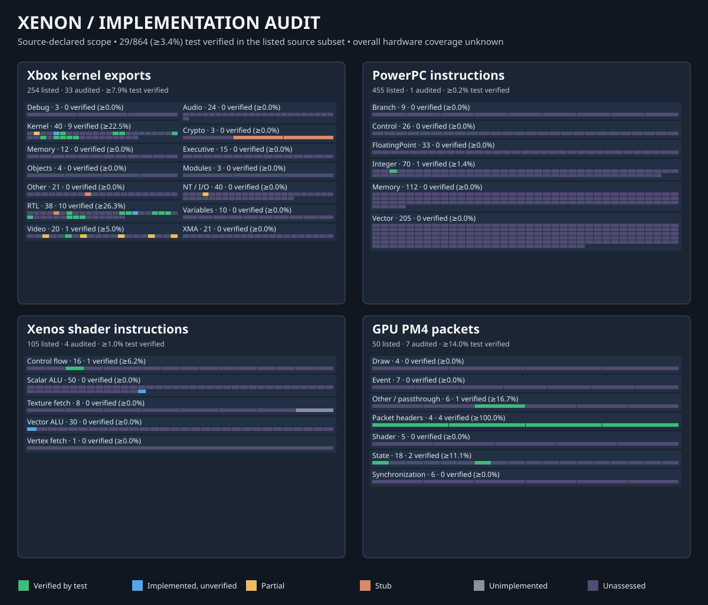

# Xenon implementation coverage dashboard

The compact [README summary](summary.svg) and this detailed treemap are generated from the same source inventory and sparse audited manifest. The summary groups operations into readable status bars; the detailed cells retain per-operation tooltips.

The [generated coverage report](REPORT.md) gives exact counts and limitations. The separate [kernel export reference reconciliation](KERNEL_REFERENCE.md) compares Xenon's source registrations with a pinned Xenia research table. Its registration percentage does not measure implementation. This audit measures traced operations in selected Xenon source inventories. It does **not** measure game compatibility or the complete Xbox 360 API/ISA. An unassessed purple cell means the implementation and tests have not yet been audited; it does not assert that the operation is missing. Green requires a reviewed behavior-oriented test whose CTest target passed in the recorded CI evidence, blue has an implementation trace without test verification, amber is partial, orange is a stub, and grey is explicitly unimplemented. Each panel also lists its count per state, and the header shows the assessed source revision.

The [Phase 2 metadata audit](PHASE2_METADATA_AUDIT.md) records corrected discrepancies and remaining source-inventory gaps.

## Automatic refresh

The [coverage-refresh workflow](AUTOMATION.md) regenerates every file here from source and from existing Windows/Linux CTest results, then proposes the result as a bot pull request. It also records machine-readable per-operation data in [`inventory.json`](inventory.json), and review suggestions and validation problems in [`audit-candidates.json`](audit-candidates.json) and [AUDIT.md](AUDIT.md). The [verification policy](VERIFICATION_POLICY.md) defines what counts as verified and which changes need a human.

## Inventories

- Kernel: statically recoverable ordinal/name registrations and variables extracted from `src/xbox/exports/`, `src/audio/exports.cpp`, and `src/core/session/exports/`, grouped by subsystem. Audio exports are included even though their registration depends on build configuration. The ten-row diagnostic RTL table is validated against registration sources, not used as a denominator. Operations absent from Xenon source remain outside the dashboard inventory. The pinned Xenia table is a separate research reference, not an official or version-qualified console export inventory.
- PPC: all `X(...)` rows in `src/cpu/ppc/decoder/opcode_catalog.inc`, grouped by its declared instruction family. These are recognized mnemonics, not proof of execution semantics.
- Shader: `ControlFlowOpcode` declarations, ALU ranges and reserved scalar opcode from lowerer checks, texture fetch cases from the lowerer, and the decoder's vertex fetch opcode. These are frontend-recognized forms, not an exhaustive hardware instruction list. Scalar opcode 41 is reserved and excluded.
- PM4: packet header types and `Type3Opcode` declarations in `include/xenon/gpu/types.hpp`, grouped by command processor classifiers. An IR passthrough is not full packet execution.

## Updating coverage

1. Change the authoritative source inventory when adding an opcode or export. Do not copy all inventory rows into the manifest.
2. Add a sparse entry to `tools/coverage/coverage.json` for each operation whose behavior has been audited. Use the source-derived `id` shown in the SVG tooltip. Choose `verified`, `implemented_unverified`, `partial`, `stub`, or `unimplemented`. Include an implementation source path and an exact token in that file if the identifier itself is absent. A verified entry also needs a test path, an exact test token and `test_target` naming the CTest executable that compiles the source. Partial and unimplemented entries need an explanatory note; a placeholder should use the distinct `stub` state. If one test genuinely verifies two operations, mark both with `"shared_test": true` and explain the shared assertion in review.
3. Ensure a verified test asserts behavior, not just that decoding or registration succeeds. Run the named CTest target and inspect its result. The generator checks that the test source belongs to a registered CTest executable; a source token alone does not establish that the test passed or asserts the intended behavior. If the test only checks registration, use `implemented_unverified` until a behavior test exists.
4. Run `python3 -m unittest discover -s tools/coverage -p 'test_*.py' -v` and `python3 tools/coverage/generate.py`, then commit the manifest change. Committing the regenerated files is optional: if you leave them out, the coverage-refresh workflow proposes them. A newly verified entry stays shown as implemented, unverified until its CTest target has a recorded passing CI result. `python3 tools/coverage/generate.py --check` is the CI stale-asset check. It fails on stale dashboard content and warns on audit records that the workflow will refresh. The kernel reference snapshot stays pinned to its cited upstream commit; update it only after checking every changed ordinal, name, and kind against the new source revision.

The scripts use only Python's standard library. Generation fails on duplicate or missing IDs, invalid states, missing evidence paths or tokens, unregistered test targets, broken `coverage-evidence:` tags, source-inventory extraction drift, and stale dashboard files. Its evidence check establishes traceability; semantic review and actual CTest execution remain separate. CI requires every selected CTest case to execute without failure, error, timeout or skip. See [CI badge relationships](CI_BADGES.md).

## Remaining metadata work

- Check the 668 reference entries without Xenon source registrations against actual title imports, console kernel versions, and any dynamic paths. The reference is a pinned research table; an authoritative version-qualified export inventory and reserved-ordinal classification are still needed.
- Connect PPC catalog entries to per-opcode lifting, fallback, and semantic test metadata. Current decoder metadata does not identify stubs or tested execution paths.
- Give Xenos ALU and fetch opcodes named source metadata and explicit test coverage tags; current numeric ranges and HLSL branches make semantic auditing difficult.
- Distinguish PM4 packet parsing, normalized IR emission, backend execution, and tests per opcode. The type-3 enum and command classifier do not encode those layers.
